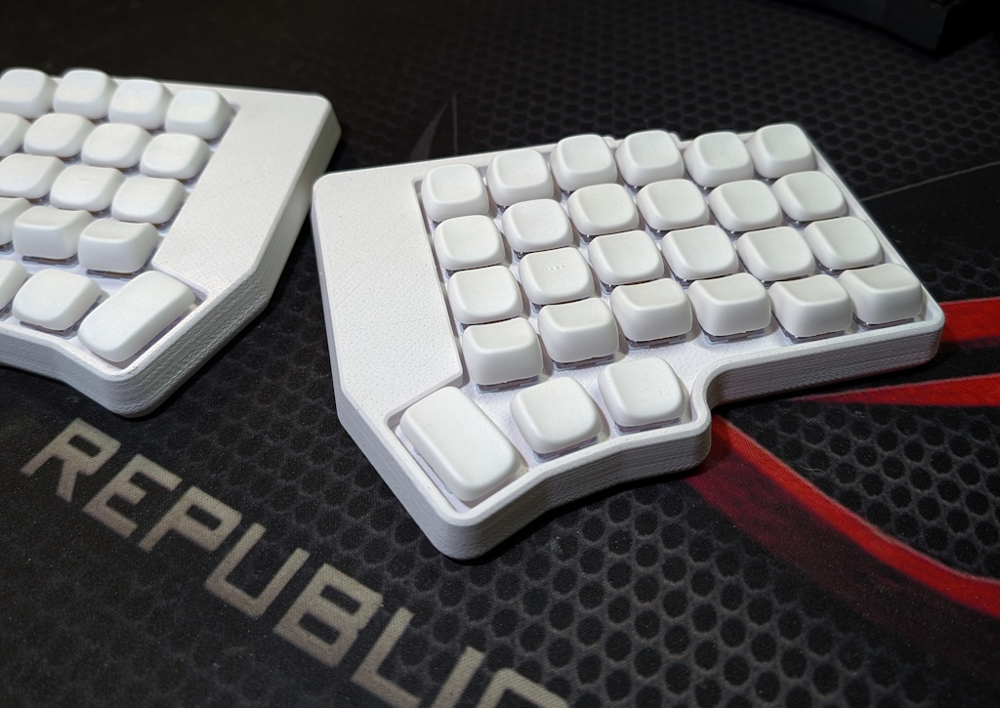

# zmk-cornedeon54

54-keys ZMK-based handwired Cornedeon

Keyboard Maintainer: [alko](https://github.com/alko-kbd/zmk-cornedeon54) [alko-kbd@alk0.ru](mailto:alko-kbd@alk0.ru)

Web Site: [cornedeon.ru](https://cornedeon.ru)

## Local build

Prepare build environvent (devcontainer) as described in ZMK docs.

~# cd zmk-workspace/zmk

~zmk-workspace/zmk# git clone https://github.com/alko-kbd/zmk-cornedeon54

~zmk-workspace/zmk# cd ..

~zmk-workspace$ devcontainer exec --workspace-folder ./zmk /bin/bash

#workspaces/zmk# ./zmk-cornedeon54/build.sh <dongle|left|right|left_central>
